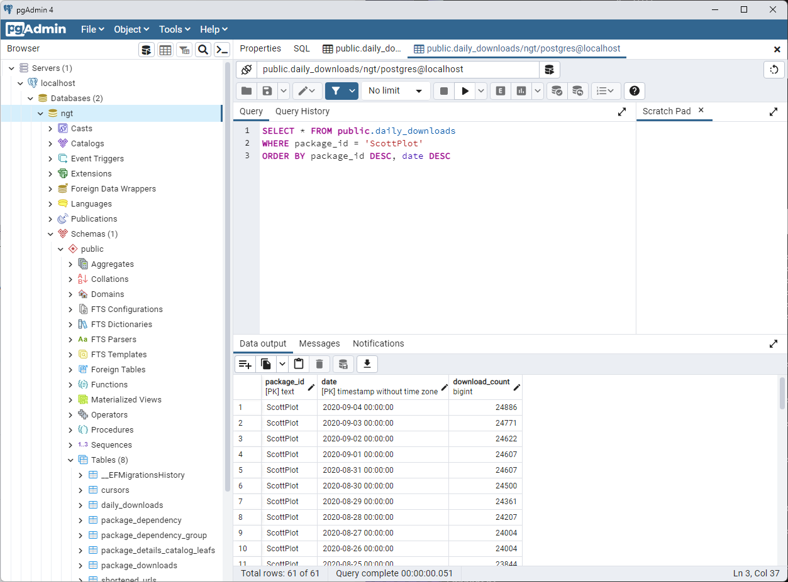

# Setup the NuGet Trends Developer Database

NuGet Trends hosts a database dump file containing the last 1 month of daily download stats. These instructions describe how to setup a postgres database and load these stats.

* Setup [PostgreSQL](https://www.postgresql.org/download/)
* Get latest database dump from NuGet Trends: [dump](https://contrib.nugettrends.com/nuget-trends-contrib.dump)
* For details see the Postgres docs: [Backup and Restore](https://www.postgresql.org/docs/current/backup.html)
* `psql -U postgres -c "DROP DATABASE IF EXISTS ngt"`
* `createdb -U postgres ngt`
* `psql -U postgres -d ngt -c "drop schema if exists public"`
* `pg_restore -U postgres -d ngt .\nuget-trends-contrib.dump`
* Open `pgAdmin4` and connect to the database

```bash
psql -U postgres -c "DROP DATABASE IF EXISTS ngt;"
createdb -U postgres ngt
psql -U postgres -d ngt -c "DROP SCHEMA IF EXISTS public;"
psql -U postgres -d ngt  -c "CREATE ROLE datadog;"
pg_restore -U postgres -d ngt .\nuget-trends-contrib.dump
```

```sql
SELECT * FROM public.daily_downloads
WHERE package_id = 'ScottPlot'
ORDER BY package_id DESC, date DESC 
```

